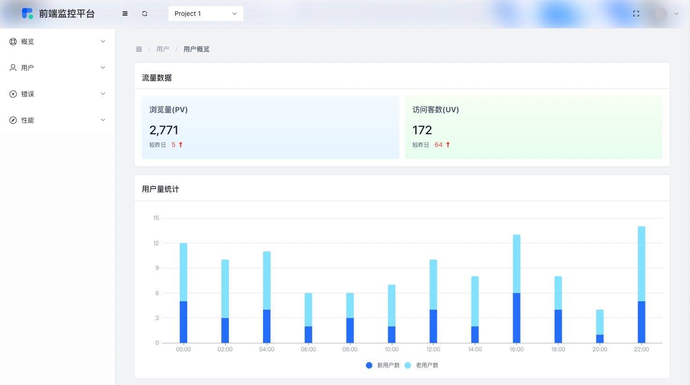

# Monitor-Koa2


[](https://badge.fury.io/js/overwatch-ui)
[](https://travis-ci.org/Haixiang6123/overwatch-ui)

## Introduction

前端监控平台是自建的一款前端监控解决方案，专注于 Web 、移动端等场景监控。聚焦用户页面性能（页面监控，接口监控，CDN 监控等）和质量（JS 错误，Ajax 错误等），配合安装 对应SDK 进行项目部署中，简单配置，实现对用户页面质量的全方位守护，实时了解线上应用健康情况。

### Built With

[![koa][koa]][koa]<br/>
[![Jest][Jest]][Jest]<br/>
[![Rollup][Rollup]][Rollup]<br/>
[![Github Actions][GithubAction]][GithubAction]<br/>
## Preview


<a href="https://github.com/Xinjn/mall-platform/issues">Report Bug</a>
·
<a href="https://github.com/Xinjn/mall-platform/issues">Request Feature</a>




## Install
```bash
$ npm install 
```

## Server

```bash
$ npm run server
```

然后用 vscode 的 `live server` 插件访问 examples 目录上的 html 文件，即可尝试体验监控 SDK 的效果。同时打开开发者工具，点击 network 标签，可以看到上报数据的发送请求。

## Development

本地开发：部分实例中的使用的是打包构建后的SDK，所以需要修改指向为 src/index.js

## [SDK](https://github.com/Xinjn/monitorSDK)

### 直接 HTML 文件中引入使用

```html
<script src="https://cdn.jsdelivr.net/npm/sdk-monitor/index.js"></script>

<script>
    monitor.init({
        url: 'http://localhost:8080/reportData'
    })
    // 手动埋点：用户点击
    monitor.behavior.onClick()
</script>
```

### 在 npm 中使用

安装
```js
npm i sdk-monitor
```

引入
```js
import monitor from 'sdk-monitor'
```

示例：用户点击
```js
mounted(){
    // 初始化
    monitor.init({
        url: 'http://localhost:3000/api/reportData' // 上报地址
    })
    // 手动埋点：用户点击
    monitor.behavior.onClick()
}
```

## Test

单元测试框架为 Jest

## License

Distributed under the MIT License. See `LICENSE.txt` for more information.

[Vue.js]: https://img.shields.io/badge/Vue.js-35495E?style=for-the-badge&logo=vuedotjs&logoColor=4FC08D
[Vue-url]: https://vuejs.org/
[Vite]: https://img.shields.io/badge/Vite-35495E?style=for-the-badge&logo=Vite
[vite-url]: https://vitejs.dev/
[Element]: https://img.shields.io/badge/element-35495E?style=for-the-badge&logo=element
[GithubAction]: https://img.shields.io/badge/Github%20Action-35495E?style=for-the-badge&logo=GitHub+Actions
[koa]: https://img.shields.io/badge/koa-35495E?style=for-the-badge&logo=koa
[Rollup]: https://img.shields.io/badge/Rollup-35495E?style=for-the-badge&logo=Rollup.js
[Jest]:https://img.shields.io/badge/jest-35495E?style=for-the-badge&logo=jest